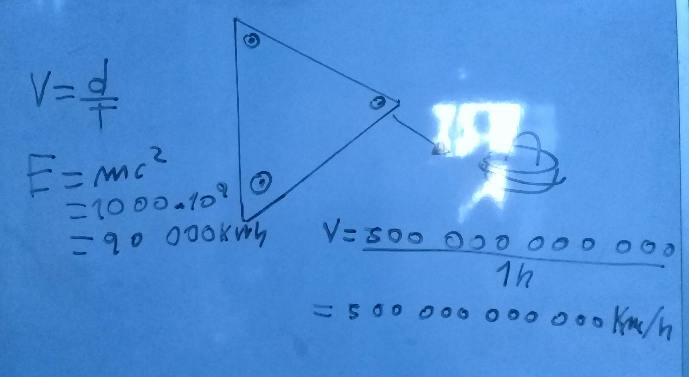

Esta nave, puede viajar más rapido que la velocidad de la luz, pero su velocidad normal es de 500000000000 km/h

Esta nave contiene esto:

* Velocidad hipersónica
* Efecto Coriolis
* Aceleración instantánea
* Antigravedad
* Efecto Mariposa

## Que es la velocidad hipersónica

Se denominan velocidades hipersónicas aquellas velocidades superiores a cinco veces la velocidad del sonido.​ Se considera que sería el siguiente nivel de velocidad por encima de la velocidad supersónica, en el cual el aire circundante de la nave se calienta hasta tal punto que se ioniza. <a href="https://es.wikipedia.org/wiki/Velocidad_hipersónica">Wikipedia</a>

## Que es el Efecto Coriolis

Este efecto consiste en la existencia de una aceleración relativa del cuerpo en dicho sistema en rotación. ... El efecto Coriolis hace que un objeto que se mueve sobre el radio de un disco en rotación tienda a acelerarse con respecto a ese disco según si el movimiento es hacia el eje de giro o alejándose de este. <a href="https://es.wikipedia.org/wiki/Efecto_Coriolis">Wikipedia</a>

## Aceleración instantánea

La aceleración instantánea de un cuerpo es la que tiene el cuerpo en un instante específico, en un punto determinado de su trayectoria. Para definir el concepto de aceleración instantánea con precisión podemos partir de la aceleración media en un intervalo y hacer este infinitamente pequeño ( ∆ t → 0 ). Más información en: <a href="https://www.fisicalab.com/apartado/aceleracion-instantanea">https://www.fisicalab.com/apartado/aceleracion-instantanea</a> 

## Antigravedad

La antigravedad es una fuerza teórica o hipotética predicha por las leyes de la física de altas energías que consiste en la repulsión de todos los cuerpos debido a una fuerza que es igual en magnitud a la gravedad pero en vez de ser atractiva, es repulsiva. <a href="https://es.wikipedia.org/wiki/Antigravedad">https://es.wikipedia.org/wiki/Antigravedad</a>

## Que es el efecto Mariposa

Este efecto lo produce una nave que se mueve muy rapido, este efecto hace que la nave brille como una luz, pero esta luz es bien fuerte y bien blanca.

## Más información

En el dibujo de la nave hay con unos circulos a los costados de las naves, estos hacen un giro, y durante ese giro hacen que la gravedad de la Tierra los mueva hacia arriba, en vez que vallan hacia abajo, usan esta misma gravedad para que vallan arriba.
